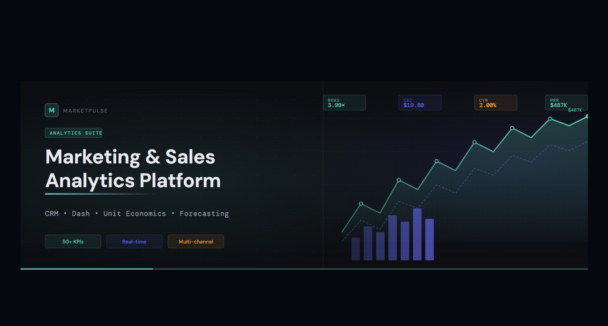

  

# 📘 Marketing & Sales Analytics Platform 
A complete analytical system designed for CRM, marketing, and sales performance analysis.
The project processes raw CRM datasets, cleans and transforms them, performs descriptive analytics, evaluates campaign and sales efficiency, analyzes geographic and language‑level patterns, builds unit economics, tests HADI growth hypotheses, and generates machine‑learning forecasts.
Finally, the project includes a full interactive dashboard for business decision‑making.

Architecture is modular and allows extending the system with new datasets, analytical modules, or machine‑learning models.

## 📁 Project Structure

analytics_project/  
   ↓  
data/  
   ↓  
Calls (CRM).xlsx  
   ↓  
Contacts (CRM).xlsx  
   ↓  
Deals (CRM).xlsx  
   ↓  
Spend (CRM).xlsx  
   ↓  
city_coords_full.csv  
   ↓  
notebooks/  
   ↓  
File 01.Data_Cleaning.ipynb  
   ↓  
File 02.Descriptive_Statistics_and_Basic_Deals_Analysis.ipynb  
   ↓  
File 03.Campaign_Effectiveness_Analysis.ipynb  
   ↓  
File 04.Sales_Department_Efficiency_Analysis.ipynb  
   ↓  
File 05.Geography_and_German_Level_Analysis.ipynb  
   ↓  
File 06.Unit_Economics_and_Growth_Hypotheses.ipynb  
   ↓  
File 07.Dashboard.ipynb  
   ↓  
reports/  
   ↓  
screenshots.pdf

## 🚀 Project Overview

### 🔹 Raw Data
The project begins with four raw CRM datasets: Calls, Contacts, Deals, Spend.
These files contain duplicates, missing values, inconsistent formats, and non‑informative CRM fields.

### 🔹 Cleaning & Preprocessing
Performed in File 01.Data_Cleaning.ipynb:

- Removed duplicates

- Dropped irrelevant CRM columns

- Cleaned missing values

- Normalized dates, numbers, and categories

- Produced clean datasets for analysis

### 🔹 Descriptive Analytics (EDA)
Performed in File 02:

- Summary statistics (mean, median, mode, range)

- Distribution analysis

- Outlier detection

- Categorical analysis (Stage, Product, Payment Type, Source)

### 🔹 Time‑Series Analysis
Performed in File 02:

- Monthly deal creation trend

- Correlation between calls and deals

- Deal closing duration analysis

### 🔹 Campaign & Source Analysis
Performed in File 03:

- CR, Revenue, AOV per campaign

- Source efficiency (Facebook, Google, Organic)

- Identification of high‑CR and low‑CR sources

- Budget optimization insights

### 🔹 Sales Department Analysis
Performed in File 04:

- Manager performance (Deals, Revenue, CR, Duration)

- Ranking managers

- Lost reason analysis (Doesn’t Answer, Changed Decision, Duplicate)

### 🔹 Payment & Product Analysis
Performed in File 03:

- Payment type impact

- Product performance

- Education type comparison (Morning vs Evening)

### 🔹 Geographic & German‑Level Analysis
Performed in File 05:

- City performance (Deals, CR, Revenue)

- German language level segmentation (A0–C2)

### 🔹 Unit Economics Model
Performed in File 06:

- UA, B, T, AOV, APC, CAC, CLTV, CM, GP

- Product profitability insights

- Identification of strongest and weakest segments

### 🔹 Machine Learning Forecasting
Performed in File 06:

- ARIMA → trend forecast

- SARIMA → seasonal forecast

- Comparison of stagnation vs natural growth

### 🔹 HADI Growth Hypotheses
Performed in File 06:

- H1: +10% CR via manager training

- H2: +20% UA via budget increase

- H3: −15% AC via shutting down zero‑CR sources

- H4: +20% CR via German‑level segmentation

- H5: +15% APC via follow‑up automation

- Each hypothesis includes: Action, Data, Impact, Test, Decision.

- HADI Simulator

### 🔹 Interactive Dashboard
Built in File 07.Dashboard.ipynb:

- KPI Dashboard

- Data Cleaning Overview

- Deals by Month

- Sales Department

- Geography & German Level

- Unit Economics

- Sales Funnel

Screenshots saved in reports/screenshots.pdf.

### 🛠 How to Use the Project

You can open and run all notebooks using:

- Jupyter Notebook  
- Visual Studio Code (with Python extension)  
- Google Colab  

No terminal commands are required.

Simply open any `.ipynb` file from the `notebooks/` folder and run the cells step by step.
